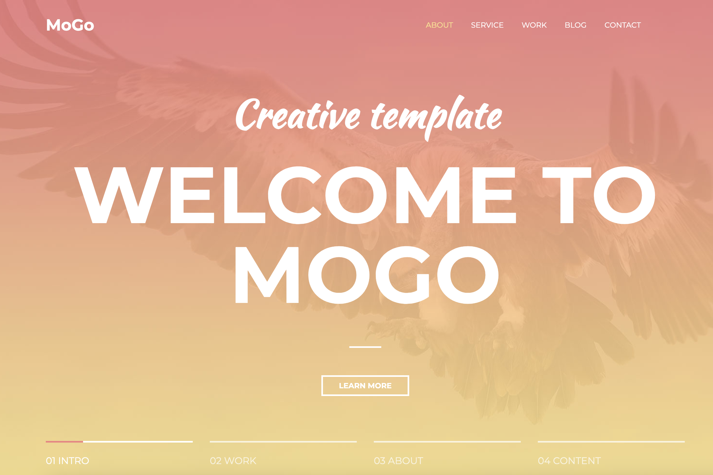
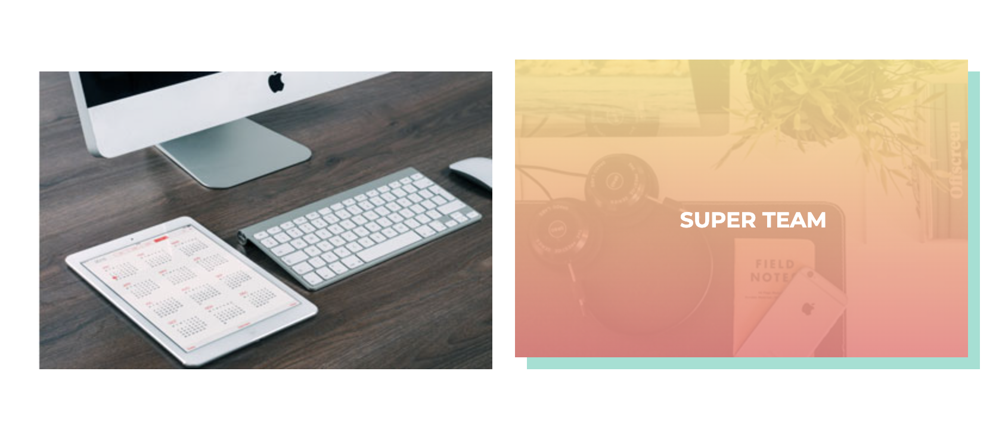
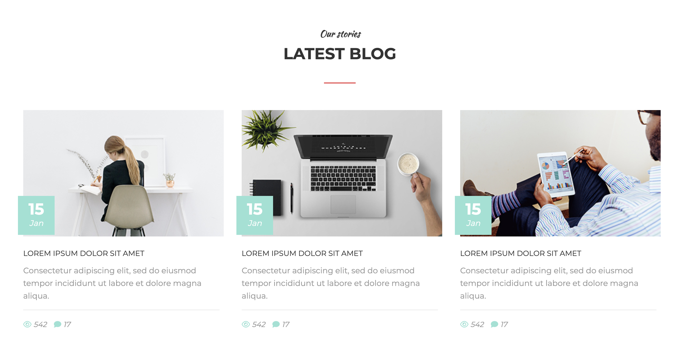
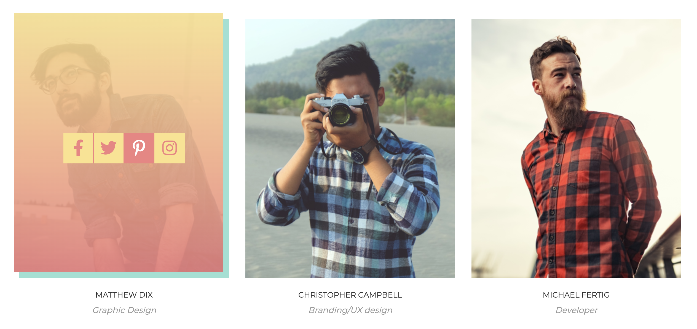

Данный проект содержит сверстанный макет сайта, сделанный с использованием HTML и CSS без использования каких-либо сторонних библиотек.
Чтобы запустить проект достаточно скачать данные из репозитория и открыть с помощью браузера

Главная страница

Красивые кнопки

Секция с блогом

Карточки работников с градиентами

